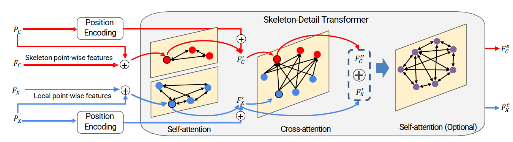

# Point Cloud Completion via Skeleton-Detail Transformer
Codes for Point Cloud Completion via Skeleton-Detail Transformer. IEEE Transactions on Visualization and Computer Graphics (TVCG), 2022. See [IEEE PDF](https://ieeexplore.ieee.org/stamp/stamp.jsp).

In this work, we present a coarse-to-fine completion framework, which makes full use of both neighboring and long-distance region cues for point cloud completion. Our network leverages a Skeleton-Detail Transformer, which contains cross-attention and self-attention layers, to fully explore the correlation from local patterns to global shape and utilize it to enhance the overall skeleton. Also, we propose a selective attention mechanism to save memory usage in the attention process without significantly affecting performance.

### 1) Pre-requisites
* Python3
* CUDA
* pytorch
* open3d-python

This code is built using Pytorch 1.7.1 with CUDA 10.2 and tested on Ubuntu 18.04 with Python 3.6.

### 2)Compile 3rd-party libs
The libs are included under `/util`, you need to first compile them where there is also a 'Readme.md' in each subfolder.

### 3)Download pre-trained models
Download pre-trained models in `trained_model` folder from [Google Drive](https://drive.google.com/drive/folders/1Fzo-FZW3LhGqkIZkXAw5GV2UYae-bQjj?usp=sharing) and put them on `trianed_model` dir.

### 4) Testing
For PCN:
1. Download ShapeNet test data on [Google Drive](https://drive.google.com/drive/folders/1o2Kwi-0127mVZjRJskY9tquJKTD-67Jm?usp=sharing). Put them on `data/pcn` folder. We use the same testing data in [PCN](https://www.cs.cmu.edu/~wyuan1/pcn/) project but we use `h5` format.
2. Run `sh test.sh`. You should first modify the `model_path` to the folder containing your pre-trained model, and `data_path` to the testing files.

For Completion3D:
1. Download the test data on [Google Drive](https://drive.google.com/drive/folders/1o2Kwi-0127mVZjRJskY9tquJKTD-67Jm?usp=sharing) or [Completion3D](https://completion3d.stanford.edu/). Put them on `data/completion3d` folder.
2. Run `test_benchmark.sh` to generate the 'submission.zip' file for Compleiont3D dataset.

### 5) Traning
For PCN
1. The training data are from [PCN repository](https://github.com/wentaoyuan/pcn), you can download training (`train.lmdb`, `train.lmdb-lock`) and validation (`valid.lmdb`, `valid.lmdb-lock`) data from `shapenet` directory on the provided training set link in PCN repository.
2. Run `python create_pcn_h5.py` to generate the training and validation files with `.h5` format.
3. Run `sh run.sh` for training.

For Compleiont3D:
You can directly download the tranining files from Compleiont3D benchmark. Run `sh run.sh` and set `dataset` to `Completion3D`.

## [Acknowledgement]
Our codes are partly from [VRCNET](https://github.com/paul007pl/VRCNet). We sincerely thank for their contribution.

